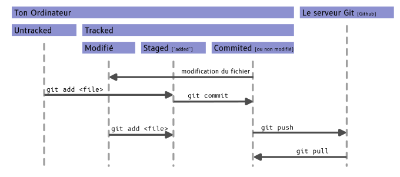

# TIPE-Mithushan-2026

## Mettre en place git

une fois que tu as créé un clé ssh

```
ssh-keygen -t ed25519 -C "your_email@example.com"
```

et que tu l'as uploadé sur github

https://docs.github.com/en/authentication/connecting-to-github-with-ssh/adding-a-new-ssh-key-to-your-github-account

tu es pret à cloner (terminologie git pour télécharger et mettre en place) le repo

```
cd le_dossier_ou_tu_veux_ranger_le_code

git clone git@github.com:drblobfish/TIPE-Mithushan-2026.git
```

si tu `ls` tu verra qu'un nouveau dossier appelé `TIPE-Mithushan-2026` a été créé et qu'il contient ce présent fichier.

Tout est prêt il ne reste qu'à coder, et utiliser l'outil en ligne de commande `git`.

## Quelques commandes git

Les commandes ne fonctionnent evidement que si le dossier de travail de ton terminal est un dossier git.

`git status` : affiche le statut de git (si ton code est à jour avec celui sur le serveur, quel fichiers ont été modifiés, etc)



